# DMD2-jittor

本项目旨在将论文 **Improved Distribution Matching Distillation for Fast Image Synthesis / DMD2** 的核心方法迁移到 **Jittor** 深度学习框架。目标是完成一个结构清晰、可运行、可验证的 Jittor 版本 DMD2 pipeline，并通过小规模数据集完成 PyTorch 与 Jittor 的结果对齐、训练日志记录和可视化展示。

原论文官网：https://tianweiy.github.io/dmd2/

## 项目结构

```text
DMD2-jittor/
  code/                  # Jittor 数据集、模型、loss、sampler、trainer 实现
  configs/               # 可复现实验配置说明
  scripts/               # 数据准备、训练、测试、转换和对齐入口脚本
  tools/                 # Python 工具：训练、采样、FID、plot、checkpoint 转换
  tests/                 # pytest 单元/集成测试
  records/               # README 引用的实验日志、曲线、样本图和报告
  requirements.txt       # Python/Jittor 运行依赖
```

## 环境配置

推荐使用独立 conda 环境：

```bash
cd DMD2-jittor
conda create -n dmd2-jittor python=3.8 -y
conda activate dmd2-jittor
pip install -r requirements.txt
```

`requirements.txt` 中固定了本项目运行和绘图所需依赖：

```text
jittor==1.3.11.0
numpy==1.24.4
Pillow==10.4.0
scipy==1.10.1
matplotlib==3.7.5
pytest==8.3.4
```

GPU 运行时通过环境变量打开 CUDA：

```bash
export CONDA_ENV=dmd2-jittor
export USE_CUDA=1
export JITTOR_HOME=/tmp/dmd2_jittor_home
export JITTOR_CACHE_ROOT=/tmp/dmd2_jittor_home
```

所有 `scripts/*.sh` 都会加载 `scripts/common.sh`。该脚本会设置 Jittor 编译缓存目录，并在 `USE_CUDA=1` 时设置 CUDA 相关变量；如果机器上存在 `/usr/bin/g++-10`，会优先用它作为 Jittor CUDA 编译器。

本次记录环境见 [records/env/system_env_20260706_014512.txt](records/env/system_env_20260706_014512.txt)，核心信息如下：

| 项目 | 实验环境 |
| --- | --- |
| OS | Ubuntu 20.04.5 LTS |
| CPU | Intel Xeon Platinum 8352V, 128 logical CPUs |
| GPU | NVIDIA vGPU-32GB, 32760 MiB |
| Driver / CUDA visible | NVIDIA-SMI 580.76.05, CUDA Version 13.0 |
| NVCC | CUDA toolkit 11.8 |
| Conda env | `dmd2-jittor` |

## 数据准备脚本

### CIFAR-10

```bash
cd DMD2-jittor
CONDA_ENV=dmd2-jittor \
DATASET=cifar10 \
DATA_ROOT=data/cifar10 \
bash scripts/download_datasets.sh
```

只检查已有数据：

```bash
CONDA_ENV=dmd2-jittor DATASET=cifar10 DATA_ROOT=data/cifar10 CHECK_ONLY=1 \
bash scripts/download_datasets.sh
```

对应配置文件：[configs/download_cifar10.yaml](configs/download_cifar10.yaml)。

## 训练脚本

### CIFAR-10 debug 训练

```bash
cd DMD2-jittor
USE_CUDA=1 RUN_NAME=cifar10_debug MAX_STEPS=50 BATCH_SIZE=8 \
bash scripts/train_cifar10_debug.sh
```

### CIFAR-10 5000 step 对齐训练

本 README 中的主要实验记录来自 CIFAR-10、batch size 32、5000 step、GAN classifier 开启、`dfake_gen_update_ratio=5` 的训练。

```bash
USE_CUDA=1 \
RUN_NAME=cifar10_dmd2_5000 \
DATASET_NAME=cifar10 \
DATA_ROOT=data/cifar10 \
MAX_STEPS=5000 \
BATCH_SIZE=32 \
MAX_SAMPLES=50000 \
LOG_INTERVAL=100 \
CHECKPOINT_INTERVAL=1000 \
EVAL_INTERVAL=500 \
TEACHER_CONFIG=cifar10 \
REAL_UNET_CHECKPOINT=../teacher-models/cifar10_teacher/cifar10_teacher_jittor.pkl \
INIT_FAKE_FROM_REAL=1 \
INIT_GENERATOR_FROM_REAL=1 \
DFAKE_GEN_UPDATE_RATIO=5 \
GAN_CLASSIFIER=1 \
GEN_CLS_LOSS_WEIGHT=3e-3 \
CLS_LOSS_WEIGHT=1e-2 \
DIFFUSION_GAN=1 \
DIFFUSION_GAN_MAX_TIMESTEP=1000 \
ENABLE_GPU_MONITOR=1 \
bash scripts/train_image_dmd2.sh
```

训练入口：[scripts/train_image_dmd2.sh](scripts/train_image_dmd2.sh)，核心 Python 实现：[tools/train_image_dmd2.py](tools/train_image_dmd2.py)。默认输出：

| 输出 | 路径 |
| --- | --- |
| checkpoint | `checkpoints/<RUN_NAME>/` |
| 采样图 | `outputs/samples/<RUN_NAME>/` |
| 训练指标 | `logs/<RUN_NAME>/train_metrics.jsonl` |
| 性能指标 | `logs/<RUN_NAME>/performance.jsonl` |
| loss 曲线 | `outputs/curves/<RUN_NAME>_loss/` |
| 性能曲线 | `outputs/curves/<RUN_NAME>_performance.svg` |

## 测试与评估脚本

### 单元/集成测试

```bash
cd DMD2-jittor
CONDA_ENV=dmd2-jittor python -m pytest tests -q
```

测试覆盖数据集、UNet/EDM 模块、loss、sampler、trainer、工具脚本和 records 检查。

### 曲线、样本和轻量 FID 导出

```bash
RUN_NAME=cifar10_dmd2_5000 \
METRICS_LOG=logs/cifar10_dmd2_5000/train_metrics.jsonl \
PERFORMANCE_LOG=logs/cifar10_dmd2_5000/performance.jsonl \
SAMPLES_INPUT=outputs/samples/cifar10_dmd2_5000 \
REF_IMAGES=data/ref_images \
bash scripts/eval_fid.sh
```

`scripts/eval_fid.sh` 会调用：

| 工具 | 用途 |
| --- | --- |
| [tools/plot_metrics.py](tools/plot_metrics.py) | 从 jsonl/csv 生成 loss 和性能曲线 |
| [tools/visualize_samples.py](tools/visualize_samples.py) | 从图片目录或 npz 生成样本网格 |
| [tools/compute_fid.py](tools/compute_fid.py) | 计算 lightweight pixel-FID |


## 实验记录索引

README 引用的图片和日志均放在 [records/](records/) 下，使用相对路径，便于 GitHub 阅读。

| 类型 | 文件 |
| --- | --- |
| Jittor 训练过程 log | [records/logs/jittor_cifar10_5000_train_metrics.jsonl](records/logs/jittor_cifar10_5000_train_metrics.jsonl) |
| Jittor 性能 log | [records/logs/jittor_cifar10_5000_performance.jsonl](records/logs/jittor_cifar10_5000_performance.jsonl) |
| PyTorch 训练过程 log | [records/logs/pytorch_cifar10_5000_train_metrics.jsonl](records/logs/pytorch_cifar10_5000_train_metrics.jsonl) |
| PyTorch 性能 log | [records/logs/pytorch_cifar10_5000_performance.jsonl](records/logs/pytorch_cifar10_5000_performance.jsonl) |
| Loss 汇总 | [records/loss/summary.json](records/loss/summary.json) |
| 性能汇总 | [records/performance/cifar10_performance_summary.json](records/performance/cifar10_performance_summary.json) |
| 图像质量指标 | [records/quality/fid_results.json](records/quality/fid_results.json), [records/quality/generated_image_quality_metrics.json](records/quality/generated_image_quality_metrics.json) |
| 精度对齐报告 | [records/reports/cifar10_pytorch_jittor_precision_alignment.md](records/reports/cifar10_pytorch_jittor_precision_alignment.md) |
| 性能报告 | [records/reports/cifar10_performance_report.md](records/reports/cifar10_performance_report.md) |
| 图像质量报告 | [records/reports/generated_image_quality_report.md](records/reports/generated_image_quality_report.md) |

## 与 PyTorch 实现对齐的实验 Log

### 训练配置对齐

| 配置项 | PyTorch | Jittor | 判断 |
| --- | --- | --- | --- |
| dataset | CIFAR-10 | CIFAR-10 | 一致 |
| image size | 32 | 32 | 一致 |
| label dim | 10 | 10 | 一致 |
| train samples | 50000 | 50000 | 一致 |
| batch size | 32 | 32 | 一致 |
| train steps | 5000 | 5000 | 一致 |
| lr generator/guidance | `2e-4 / 2e-4` | `2e-4 / 2e-4` | 一致 |
| Adam beta1/beta2 | `0.0 / 0.999` | `0.0 / 0.999` | 一致 |
| `dfake_gen_update_ratio` | 5 | 5 | 一致 |
| GAN classifier | enabled | enabled | 一致 |
| generator GAN weight | `3e-3` | `3e-3` | 一致 |
| guidance classifier weight | `1e-2` | `1e-2` | 一致 |
| diffusion GAN max timestep | 1000 | 1000 | 一致 |

训练调度记录中 `compute_generator_gradient` 的 mean 为 `0.2`，对应 5000 step 内 generator 更新 1000 次、guidance 更新 5000 次，符合 DMD2 每 5 step 更新一次 generator 的 TTUR 结构。

### Forward 对齐

| 对齐项 | 误差统计 | 判断 |
| --- | ---: | --- |
| CIFAR-10 teacher EDM forward | MAE `2.2411025e-7`, max AE `9.1642141e-7` | teacher 权重转换和 EDM forward 高精度对齐 |

### 训练过程 Log 示例

完整逐 step 日志见 [records/logs/jittor_cifar10_5000_train_metrics.jsonl](records/logs/jittor_cifar10_5000_train_metrics.jsonl)。下面摘录首尾 step，字段包括 DMD loss、GAN 判别概率、guidance loss、耗时和吞吐：

```json
{"step": 1.0, "compute_generator_gradient": 1.0, "generator/loss_dm": 5.6188e-08, "generator/gen_cls_loss": 0.7313, "loss_generator": 0.0022, "guidance/loss_fake_mean": 0.0992, "loss_guidance": 0.1128, "samples_per_second": 8.3582, "step_time": 3.8065}
{"step": 5000.0, "compute_generator_gradient": 0.0, "gan/fake_prob_mean": 0.3368, "gan/real_prob_mean": 0.7911, "guidance/loss_fake_mean": 0.4379, "loss_guidance": 0.4485, "samples_per_second": 50.7264, "step_time": 0.6267}
```

### Loss 数值对齐

Generator 相关指标只统计实际 generator update 的 1000 个点；guidance 指标统计全部 5000 个点。GAN 单点波动较大，因此以 mean 判断整体尺度更可靠。

| 指标 | count | PyTorch mean | Jittor mean | mean 相对差 | 判断 |
| --- | ---: | ---: | ---: | ---: | --- |
| `loss_generator` | 1000 | `0.0480564` | `0.0478026` | `0.53%` | 高度接近 |
| `generator/loss_dm` | 1000 | `0.0399357` | `0.0391488` | `1.97%` | DMD 主损失对齐 |
| `generator/gen_cls_loss` | 1000 | `2.7068744` | `2.8846106` | `6.57%` | 同量级，GAN 波动可接受 |
| `loss_guidance` | 5000 | `0.5078256` | `0.4919454` | `3.13%` | 基本对齐 |
| `guidance/loss_fake_mean` | 5000 | `0.5013468` | `0.4856790` | `3.13%` | fake score 目标对齐 |
| `guidance/guidance_cls_loss` | 5000 | `0.6478751` | `0.6266346` | `3.28%` | GAN 判别方向对齐 |

#### Generator 总 loss

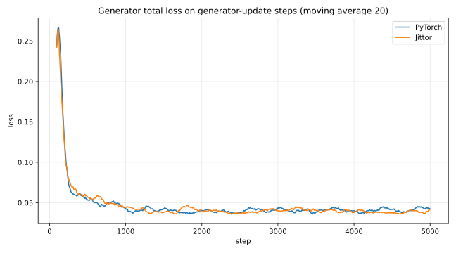

#### DMD 分布匹配 loss

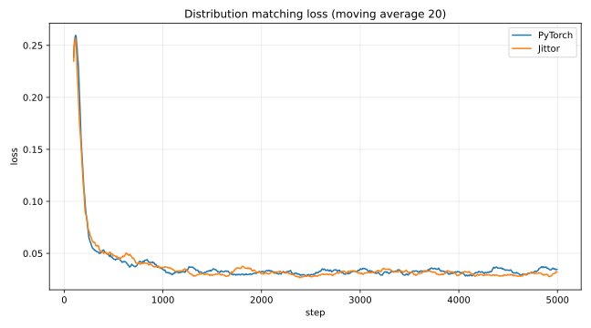

#### Generator GAN loss

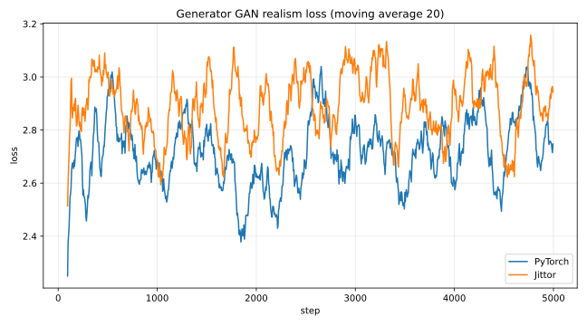

#### Guidance 总 loss

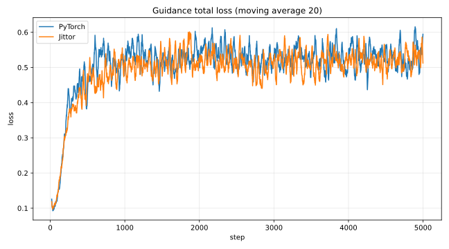

#### Fake score denoising loss


#### Guidance GAN classifier loss

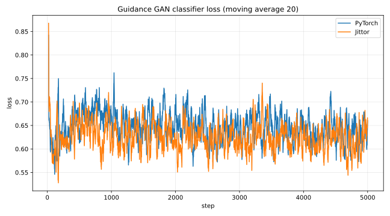

### 结果与可视化对齐

PyTorch 与 Jittor 训练采样节点总览：

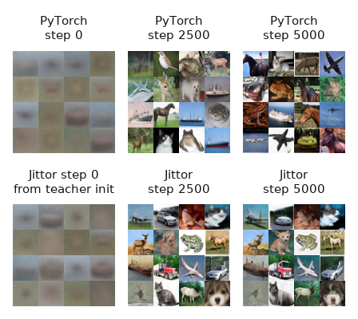

展示节点说明：

| 框架 | step 0 | step 2500 | step 5000 |
| --- | --- | --- | --- |
| PyTorch | [records/samples/pytorch/pytorch_step_000000.png](records/samples/pytorch/pytorch_step_000000.png) | [records/samples/pytorch/pytorch_step_002500.png](records/samples/pytorch/pytorch_step_002500.png) | [records/samples/pytorch/pytorch_step_005000.png](records/samples/pytorch/pytorch_step_005000.png) |
| Jittor | [records/samples/jittor/jittor_step_000000_from_teacher.png](records/samples/jittor/jittor_step_000000_from_teacher.png) | [records/samples/jittor/jittor_fixed_step_002500.png](records/samples/jittor/jittor_fixed_step_002500.png) | [records/samples/jittor/jittor_fixed_step_005000.png](records/samples/jittor/jittor_fixed_step_005000.png) |

图像质量采用本地可复现的 `Pixel-FID@8x8` sanity check：把 sample grid 拆成 32x32 CIFAR-10 小图，再平均池化到 8x8 RGB 像素特征，与 CIFAR-10 train split 统计计算 Frechet Distance。

| 对象 | step | 小图数 | Pixel-FID@8x8 |
| --- | ---: | ---: | ---: |
| PyTorch supplemented-grid | 5000 | 16 | `5.7798` |
| Jittor fixed-grid | 5000 | 16 | `4.4016` |
| Jittor random-grid | 5000 | 16 | `5.4154` |
| PyTorch local-record | 2500 | 16 | `4.5823` |
| Jittor fixed-grid | 2500 | 16 | `4.4840` |

展示用 0/2500/5000 三节点聚合结果：

| 对象 | 小图数 | Pixel-FID@8x8 |
| --- | ---: | ---: |
| PyTorch display 0/2500/5000 | 48 | `2.1769` |
| Jittor display 0/2500/5000 | 48 | `2.8948` |

边界说明：这些数值只适合作为已有样本图的本地质量检查；如果要下正式生成质量结论，需要为 PyTorch/Jittor 各生成 50k 张最终单图，并用 Inception-FID、KID 或 IS 评估。

## 性能 Log

完整性能日志：

| 框架 | 文件 |
| --- | --- |
| Jittor | [records/logs/jittor_cifar10_5000_performance.jsonl](records/logs/jittor_cifar10_5000_performance.jsonl) |
| PyTorch | [records/logs/pytorch_cifar10_5000_performance.jsonl](records/logs/pytorch_cifar10_5000_performance.jsonl) |

本次 CIFAR-10 5000 step 单卡记录中，Jittor post-warmup median 吞吐为 `50.6978` samples/s，PyTorch 为 `37.3874` samples/s，约为 PyTorch 的 `1.36x`。Jittor post-warmup median total time 为 `0.6312` s/step，PyTorch 为 `0.8559` s/step。

| 指标 | PyTorch post-warmup median | Jittor post-warmup median | 说明 |
| --- | ---: | ---: | --- |
| `samples_per_second` | `37.3874` | `50.6978` | 越高越快 |
| `total_time` | `0.8559` | `0.6312` | data + step 端到端耗时 |
| `step_time` | `0.8459` | `0.6271` | 纯训练 step 耗时 |
| `data_time` | `0.0058` | `0.0041` | 数据读取/准备耗时 |

Generator update step 比 guidance-only step 慢，这是 DMD2 训练结构预期现象：

| 框架 | step 类型 | count | median step_time | median total_time | median samples/s |
| --- | --- | ---: | ---: | ---: | ---: |
| PyTorch | generator update | 1000 | `1.4188` | `1.4241` | `22.4708` |
| PyTorch | guidance-only | 4000 | `0.7801` | `0.7860` | `40.7107` |
| Jittor | generator update | 1000 | `1.0824` | `1.0865` | `29.4524` |
| Jittor | guidance-only | 4000 | `0.6243` | `0.6283` | `50.9271` |

### 吞吐与耗时曲线

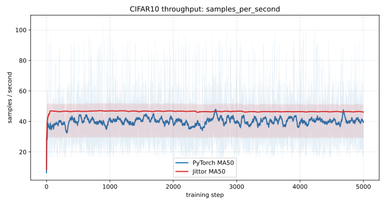

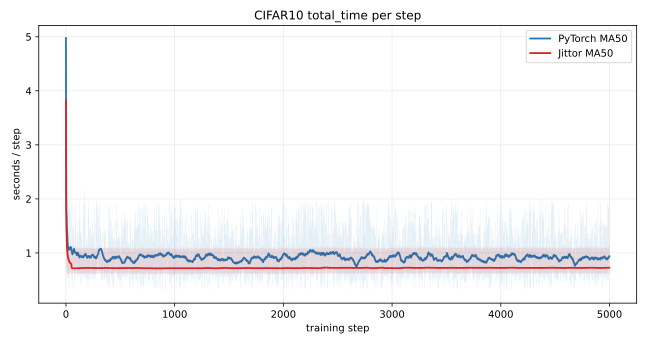

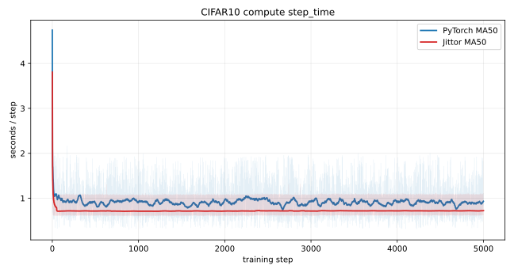

### Generator update vs guidance-only

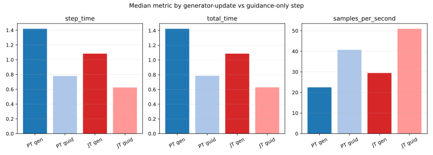

### GPU 与显存记录

Jittor 侧 GPU 指标来自 `nvidia-smi` 对齐采样；PyTorch 显存来自 `torch.cuda` allocator 字段。两者来源不同，适合分别展示，不建议直接作为严格显存优劣结论。

| 指标 | mean | median | P95 | max |
| --- | ---: | ---: | ---: | ---: |
| Jittor `gpu_utilization_percent` | `80.1720` | `100.0000` | `100.0000` | `100.0000` |
| Jittor `gpu_memory_used_mib` | `16400.4618` | `16401.0000` | `16401.0000` | `16401.0000` |
| Jittor `gpu_power_draw_w` | `171.5378` | `171.4133` | `179.3137` | `183.8800` |
| PyTorch `torch_memory_allocated_mb` | `2412.6785` | `2412.6787` | `2412.6787` | `2412.6787` |
| PyTorch `torch_step_peak_memory_allocated_mb` | `8910.7809` | `8910.6157` | `8912.1177` | `8912.1177` |
| PyTorch `torch_memory_reserved_mb` | `9287.8668` | `9288.0000` | `9288.0000` | `9288.0000` |

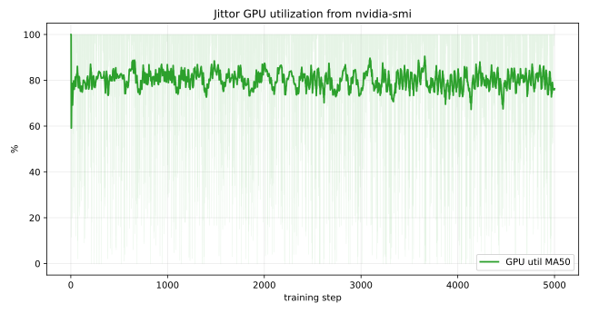

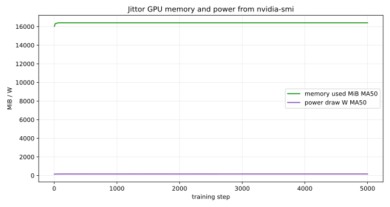

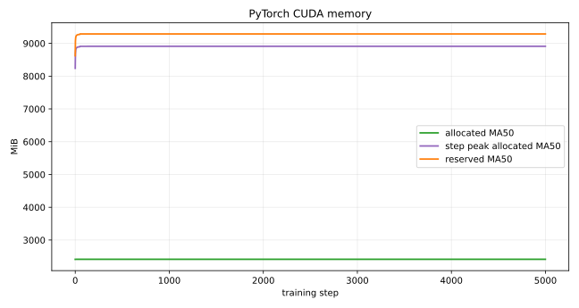

-----

#### 项目总结

- 实现了 DMD2 在 Jittor 框架下的核心训练 pipeline，包含数据加载、EDM/UNet 模型、guidance/fake-score 模型、DMD loss、GAN loss、EMA、checkpoint 保存与恢复、训练循环和采样评估等模块。
- 实现了 CIFAR-10 数据入口，并提供 `scripts/download_datasets.sh`、`tools/download_datasets.py` 等数据准备脚本，支持数据下载、断点续传、完整性检查和不同数据集根目录配置。
- 实现了 CIFAR-10 小规模 DMD2 训练脚本，支持 debug run 和 5000 step 对齐实验；训练过程中可记录 `train_metrics.jsonl`、`performance.jsonl`、checkpoint、固定噪声采样图、随机采样图和曲线摘要。
- 实现了 DMD2 训练调度中的 TTUR 逻辑：guidance/fake-score 分支每 step 更新，generator 按 `dfake_gen_update_ratio=5` 周期更新；训练日志中记录了 `compute_generator_gradient`，可直接验证 generator 更新频率。
- 实现了与 PyTorch 参考实现对齐的 loss 记录与可视化，覆盖 `loss_generator`、`generator/loss_dm`、`generator/gen_cls_loss`、`loss_guidance`、`guidance/loss_fake_mean`、`guidance/guidance_cls_loss` 等关键指标。
- 实现了实验结果可视化工具，支持从训练输出生成样本网格、从 jsonl/csv 生成 loss 曲线和性能曲线，并将 PyTorch/Jittor step 0、2500、5000 的采样结果整理为对比图。
- 实现了轻量图像质量评估流程，使用 `Pixel-FID@8x8` 对已有 CIFAR-10 sample grid 做本地 sanity check，并保存 `fid_results.json` 和完整图像质量统计报告。
- 实现了性能日志采集与展示，记录 step time、total time、data time、samples per second，并补充 Jittor 侧 `nvidia-smi` GPU 利用率、显存、功耗曲线以及 PyTorch 侧 CUDA allocator 显存指标。
- 整理了完整实验记录目录 `records/`，将 README 中引用的日志、曲线、样本图、质量报告、性能报告和系统环境信息全部放入项目内，并使用相对路径保证 GitHub 页面可直接查看。
- 完成了 CIFAR-10 5000 step PyTorch-Jittor 对齐实验整理：训练配置、TTUR 更新节奏、核心 loss 均值、GAN 判别趋势、采样图和性能结果均已在 README 中给出表格或曲线。
