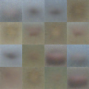
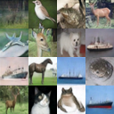
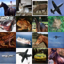
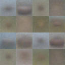
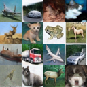

# 生成图片质量评估报告

生成时间：2026-07-11 01:06:12  
图片来源：`/home/koishi/DMD2/DMD2-jittor/records/samples`  
指标来源：`/home/koishi/DMD2/DMD2-jittor/records/quality`

## 结论摘要

- 当前报告使用 `records/samples` 中保存的 PyTorch/Jittor CIFAR10 采样图进行展示。
- 本地质量指标使用 `Pixel-FID@8x8`：从 128x128 sample grid 拆出 16 张 32x32 CIFAR10 小图，再用 8x8 RGB 像素特征计算 Frechet Distance。
- 当前可对照的 step5000 结果：PyTorch step5000=`5.7798`，Jittor fixed step5000=`4.4016`。该指标越低表示低维像素分布越接近 CIFAR10 train。
- 机器可读结果保存于 `../quality/generated_image_quality_metrics.json` 与 `../quality/fid_results.json`。

## 展示图片

### PyTorch / Jittor 训练节点总览

### PyTorch 采样图

| step | 文件 |
| ---: | --- |
| 0 | `../samples/pytorch/pytorch_step_000000.png` |
| 2500 | `../samples/pytorch/pytorch_step_002500.png` |
| 5000 | `../samples/pytorch/pytorch_step_005000.png` |

### Jittor 采样图

| step | 文件 |
| ---: | --- |
| 0 | `../samples/jittor/jittor_step_000000_from_teacher.png` |
| 2500 | `../samples/jittor/jittor_fixed_step_002500.png` |
| 5000 | `../samples/jittor/jittor_fixed_step_005000.png` |

## 本地评估范围

| 项目 | 数量/状态 |
| --- | ---: |
| PyTorch sample grid | 3 个 grid，step 0 / 2500 / 5000 |
| Jittor sample grid | 3 个 grid，step 0 / 2500 / 5000 |
| 每个 grid 小图数 | 16 张 32x32 小图 |
| CIFAR10 train 参考图 | 50000 张 |
| CIFAR10 test 参考图 | 10000 张 |

## Pixel-FID@8x8 评估方法

1. 将每张 128x128 grid 拆成 16 张 32x32 小图。
2. 将每张 32x32 小图平均池化到 8x8，得到 8x8x3=192 维像素特征。
3. 用 CIFAR10 train 的 50000 张图计算参考均值与协方差。
4. 对生成图特征和真实图特征计算 Frechet Distance。

| 对象 | 小图数 | Pixel-FID@8x8 | 来源图片 |
| --- | ---: | ---: | --- |
| PyTorch step 5000 | 16 | 5.7798 | `../samples/pytorch/pytorch_step_005000.png` |
| Jittor fixed step 5000 | 16 | 4.4016 | `../samples/jittor/jittor_fixed_step_005000.png` |
| PyTorch step 2500 | 16 | 4.5823 | `../samples/pytorch/pytorch_step_002500.png` |
| Jittor fixed step 2500 | 16 | 4.4840 | `../samples/jittor/jittor_fixed_step_002500.png` |

展示用三节点聚合结果如下。它把 step 0/2500/5000 的展示小图合并计算，用于描述当前展示集整体像素分布。

| 对象 | 小图数 | Pixel-FID@8x8 |
| --- | ---: | ---: |
| PyTorch display 0/2500/5000 | 48 | 2.1769 |
| Jittor display 0/2500/5000 | 48 | 2.8948 |

FID 结果 JSON：`../quality/fid_results.json`  
完整质量指标 JSON：`../quality/generated_image_quality_metrics.json`

## 指标解释

| 指标 | 含义 | 方向 |
| --- | --- | --- |
| Pixel-FID@8x8 | 8x8 RGB 像素特征上的 Frechet Distance | 越低越接近 CIFAR10 train 的低维像素分布 |
| 亮度均值 / 亮度std | 灰度亮度的均值和标准差 | 应接近真实 CIFAR10；过低偏暗，过高偏亮 |
| 像素std | RGB 像素整体标准差 | 太低通常偏灰/模糊，太高可能噪声重 |
| 熵(bits) | 灰度直方图信息量 | 太低说明颜色/纹理单一；过高也可能是噪声 |
| 清晰度LapVar | 灰度 Laplacian 方差 | 太低偏糊，过高可能有噪声或棋盘纹 |
| 多样性RMSE | grid 内小图两两像素 RMSE 均值 | 越高通常多样性越强 |
| 最近真实RMSE | 8x8 下采样特征到 CIFAR10 train 最近邻 RMSE | 用作生成图靠近真实训练分布的低维像素参照 |

## CIFAR10 真实参考统计

| 参考集 | 图片数 | 亮度均值 | 亮度std | 像素std | 熵(bits) | 清晰度LapVar | 多样性RMSE |
| --- | ---: | ---: | ---: | ---: | ---: | ---: | ---: |
| CIFAR10 train | 50000 | 0.4809 | 0.2392 | 0.2516 | 7.8734 | 0.034072 | 0.3416 |
| CIFAR10 test | 10000 | 0.4839 | 0.2387 | 0.2512 | 7.8722 | 0.034014 | 0.3428 |

测试集中 1000 张图到 train set 的最近真实 RMSE-8x8 均值为 `0.1218`，可作为真实 CIFAR 图像到训练分布的粗略参照。

## 最新可用生成图评估

| 对象 | step | 小图数 | 亮度均值 | 亮度std | 像素std | 熵(bits) | 清晰度LapVar | 多样性RMSE | 最近真实RMSE | Pixel-FID@8x8 | FD-color | 文件 |
| --- | ---: | ---: | ---: | ---: | ---: | ---: | ---: | ---: | ---: | ---: | ---: | --- |
| PyTorch step 5000 | 5000 | 16 | 0.4056 | 0.2472 | 0.2637 | 7.7748 | 0.038767 | 0.3649 | 0.1295 | 5.7798 | 0.021812 | `../samples/pytorch/pytorch_step_005000.png` |
| Jittor fixed step 5000 | 5000 | 16 | 0.4778 | 0.2443 | 0.2568 | 7.8079 | 0.032755 | 0.3554 | 0.1272 | 4.4016 | 0.005791 | `../samples/jittor/jittor_fixed_step_005000.png` |

## 关键训练节点评估

| 对象 | step | 小图数 | 亮度均值 | 亮度std | 像素std | 熵(bits) | 清晰度LapVar | 多样性RMSE | 最近真实RMSE | Pixel-FID@8x8 | FD-color | 文件 |
| --- | ---: | ---: | ---: | ---: | ---: | ---: | ---: | ---: | ---: | ---: | ---: | --- |
| PyTorch step 0 | 0 | 16 | 0.4906 | 0.0566 | 0.0697 | 5.8032 | 0.000314 | 0.0831 | 0.0460 | 6.3844 | 0.115385 | `../samples/pytorch/pytorch_step_000000.png` |
| PyTorch step 2500 | 2500 | 16 | 0.5099 | 0.2284 | 0.2409 | 7.7306 | 0.021647 | 0.3302 | 0.1090 | 4.5823 | 0.009580 | `../samples/pytorch/pytorch_step_002500.png` |
| PyTorch step 5000 | 5000 | 16 | 0.4056 | 0.2472 | 0.2637 | 7.7748 | 0.038767 | 0.3649 | 0.1295 | 5.7798 | 0.021812 | `../samples/pytorch/pytorch_step_005000.png` |
| Jittor fixed step 2500 | 2500 | 16 | 0.5138 | 0.2387 | 0.2520 | 7.7497 | 0.031368 | 0.3466 | 0.1289 | 4.4840 | 0.006449 | `../samples/jittor/jittor_fixed_step_002500.png` |
| Jittor fixed step 5000 | 5000 | 16 | 0.4778 | 0.2443 | 0.2568 | 7.8079 | 0.032755 | 0.3554 | 0.1272 | 4.4016 | 0.005791 | `../samples/jittor/jittor_fixed_step_005000.png` |

## 当前结果解读

1. 当前 records 中 PyTorch 与 Jittor 都具备 step 0/2500/5000 的展示图，可直接对照训练过程中的视觉变化。
2. 从本地 `Pixel-FID@8x8` 看，Jittor fixed step5000 的低维像素分布更接近 CIFAR10 train；PyTorch step5000 的数值高于 PyTorch step2500，说明这批 16 张图的低维分布距离更大。
3. Jittor step0 图来自 teacher 初始化展示，step2500/5000 使用 fixed-grid，可用于观察同一固定输入随训练推进的变化。
